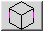
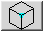
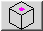
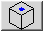
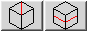
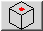
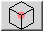

# Cubie

A Rubik's Cube tool for playing, viewing, solving, and generating solutions and
scrambles.

- [Cubie](https://www.jaapsch.net/puzzles/cubie.htm)
- [Jaap's Puzzle Page](http://www.jaapsch.net/puzzles/)

Written by Jaap Scherphuis © 2003, 2004, 2018.

## Table of Contents <!-- omit in toc -->

- [Features](#features)
- [Build Instructions](#build-instructions)
  - [Install Java 6 on macOS](#install-java-6-on-macos)
  - [Build Cubie](#build-cubie)
- [Usage Instructions](#usage-instructions)
  - [Playing](#playing)
  - [Viewing](#viewing)
  - [Solving (Normal)](#solving-normal)
  - [Solution / Generator](#solution--generator)
  - [Playback](#playback)
  - [Supergroup](#supergroup)
  - [Editing](#editing)
  - [Inputting](#inputting)
  - [Subgroups](#subgroups)
  - [Indicators](#indicators)
  - [Solving (Subgroups)](#solving-subgroups)
  - [Symmetry Type](#symmetry-type)
  - [Rotating / Reflecting](#rotating--reflecting)
  - [Random Symmetric Patterns](#random-symmetric-patterns)
  - [Random Pretty Patterns](#random-pretty-patterns)

## Features

1. The cube is fully playable. Middle slices can be turned, as well as the whole
   cube.
1. The cube can be viewed in four ways, such as a fully 3D model, or as a flat
   layout. The view can be switched at any time.
1. It has a powerful built-in solver. It uses a simplified version of the
   two-phase algorithm devised by Herbert Kociemba.
1. Instead of a solution move sequence, the generator can be shown, i.e. the
   move sequence that gives a cube pattern instead of solving it.
1. A solution/generator sequence can be played back.
1. The orientation of the cube's face centres can be made visible, i.e. the
   supergroup is used.
1. The cube can be edited, i.e. the pieces can be rearranged to form any preset
   pattern. The colour scheme may also be changed.
1. Any move sequence can be typed in and shown on the cube.
1. Play can be restricted to one of 4 subgroups of the cube, namely the Square
   group (half turns only), the Slice group, the Anti-Slice group, or the
   two-generator group (R and U faces only).
1. For each group it is always shown whether the current cube pattern lies
   within it.
1. For each of the aforementioned subgroups there is an optimal solver, able to
   give the shortest possible move sequence that solves (or generates) a
   position in that group.
1. The type of symmetry of the current cube pattern can be shown.
1. The cube and its solution/generator sequence can be rotated or reflected in
   every way.
1. The cube can be mixed randomly while still conforming to a particular
   symmetry type.
1. Random pretty patterns can be generated easily.

## Build Instructions

### Install Java 6 on macOS

- [Install Multiple Java Versions](https://gist.github.com/ntamvl/5f4dbaa8f68e6897b99682a395a44c2e)
- [Configure jEnv](https://developer.bring.com/blog/configuring-jenv-the-right-way/)

```sh
brew tap homebrew/cask-versions
brew cask install java6
jenv add /Library/Java/JavaVirtualMachines/1.6.0.jdk/Contents/Home
jenv local 1.6
java -version
```

**Note:** Restart your shell

### Build Cubie

- [Compile Java on macOS](https://centerkey.com/mac/java/)

#### Compile and Run

```sh
cd src
javac Cubie.java -d ../build
cd ../build
java Cubie
```

#### Package and Run Jar File

```sh
echo "Main-Class: Cubie" > MainClass.txt
cd build
jar cmfv ../MainClass.txt ../Cubie.jar *.class
cd ..
java -jar Cubie.jar
```

## Usage Instructions

### Playing

Simply drag the facelet of any piece in the direction that you wish to move it
and then that move will be performed. If you hold down the Shift key when you do
a move, it will be a half turn instead of a quarter turn. Similarly holding down
the Ctrl or Alt key performs a slice or anti-slice move respectively (note that
this may be combined with the shift key). If you drag a face centre then the
whole cube will move in that direction.

In the 3D view, dragging the mouse from a position outside the cube allows you
to turn the whole cube freely. The MIX button causes the cube to become randomly
mixed, and the RESET button puts it in the solved position.

### Viewing

Click the Change View button to switch between the four possible views. The
Reset View button will rotate the cube back to its original orientation.

### Solving (Normal)

Click the Solve button to start the solver. While it is searching a green light
will show, and when it has found a solution it will be shown in the text box.
The solution may not be the best possible, so pressing the Solve button again
restarts the solver so that it can try to find a better solution. The search may
be interrupted by pressing the button (now marked Stop) while the solver is
running.

Note there is a subtle difference between the 3D cube viewer, and the other
three viewers. In the 3D viewer there is no fixed cube orientation. Therefore
unless the colours have been edited, regardless of the actual orientation of the
cube, the Blue face on the 3D cube is considered the U (Up) face, and Yellow is
the F (Front) face.

The solver uses the two-phase algorithm devised by Herbert Kociemba. The best
version of this algorithm can currently be found in
[Herbert's Cube Explorer](http://kociemba.org/cube.htm). This applet uses much
smaller pruning tables, so it will certainly not be as fast as that. Note also
that older Java virtual machines tend to be quite a bit slower than more up to
date ones (though Cubie will run in Java 1.1).

When the applet has just started, a red light will show while the solver
prepares various tables for the algorithm. This should only take a few seconds
during which time the solver is not available.

### Solution / Generator

The move sequence that the solver gives is usually a solution, i.e. the move
sequence solves the current cube position. Pressing the Solution button next to
the text box changes it to Generator. The move sequence has now been inverted,
so that it has become the sequence that generates the current cube position when
performed on a clean cube. This may be of use when you wish to recreate pretty
patterns.

### Playback

When there is a move sequence in the text box, the six playback buttons below it
can be used to show the move sequence being performed on the cube. There are six
buttons. The two outer ones (showing two triangles with a vertical bar) jump
forward or backwards to the start or end position. The step buttons (showing a
single triangle with a vertical bar) perform a single move of the sequence. The
playback buttons (showing only a single triangle) play through the whole
sequence step by step. Note that the current position within the move sequence
is marked by an underscore ( `_` ) character.

### Supergroup

By checking the Supergroup box, the orientation of the cube's face centres is
made visible. The solver will now also take those orientations into account, so
it may take a lot longer for a solution to be found.

### Editing

Press the Edit button to go into edit mode. You may can now rearrange the cube
position as follows:

1. Drag a facelet of one piece to the facelet of another. This swaps those two
   pieces.
2. Drag a facelet of one piece to another facelet of the same piece. This twists
   or flips that piece.
3. Click a centre facelet. This twists that centre facelet, but this is only
   visible if the supergroup box has been ticked.
4. Drag a centre facelet to another centre facelet. This swaps those two colours
   wherever they occur on the cube. Note that this change is permanent, and is
   not affected by the Reset button.

When you have finished, press the Play button (and it will change back into the
Edit button), and then the cube can be played with.

### Inputting

To input a move sequence, just type it into the text box, and press enter. The
cube will change to that position accordingly. You may also edit a move sequence
that was generated by the solver. Remember that the sequence can be either a
generator or a solution.

### Subgroups

You may choose a particular cube group by clicking on the list on the right.
When in a subgroup, only moves in that group are allowed. In the square group
for example, every move will automatically be a half turn. In the slice and
anti-slice groups moving one face will cause its opposite face to move as well.
In the two-generator group only moves of the right and up faces will be allowed.

### Indicators

The tick marks next to the list of subgroups indicate whether or not the current
cube position can be solved within each subgroup. Note that the indicator next
to the Normal cube group shows whether the cube can be solved without taking it
apart. It is possible to create such an impossible position when editing by
swapping two pieces or twisting a single piece.

### Solving (Subgroups)

If a subgroup is selected, and the current position can be solved in that
subgroup (i.e. its indicator has a tick mark) then you can press the solve
button to solve it. A solution will then be found that is as short as possible.
Pressing the Solve button again will give alternative solutions, but these might
not be optimal. If the supergroup box is marked, then the face centre
orientations will be taken into account as well.

### Symmetry Type

Choose the Symmetries tab on the right. The symmetry type of the current cube is
shown at the top left.

### Rotating / Reflecting

In the symmetries tab there are many buttons showing the various
rotations/reflections. Hold down shift (or Alt) and click any such button to
perform that rotation/reflection on the current cube. If you hold down Control
and click a button, the rotation/reflection is done on the moving pieces only
and not on the face centres.

Icon|Description
----|-----------
|Rotation around edge
 |Rotation around corner
|1/2 Rotation around face
 |1/4 Rotation around face
 |Reflection through a plane
 |Reflection/rotation through a plane
 |Reflection through the centre

### Random Symmetric Patterns

Click any rotation/reflection buttons (without shift) to select or deselect
them. The symmetry group generated by the selected rotations/reflections is
shown on the right. Pressing the Clear button deselects them all again. Press
the Mix button to generate a random pattern conforming to the chosen symmetry
type.

### Random Pretty Patterns

If the Two Colours box is ticked, then pressing the Mix button will generate a
random pattern that conforms to the selected symmetry and also has at most two
colours on each face of the cube. These patterns tend to be very pretty.
